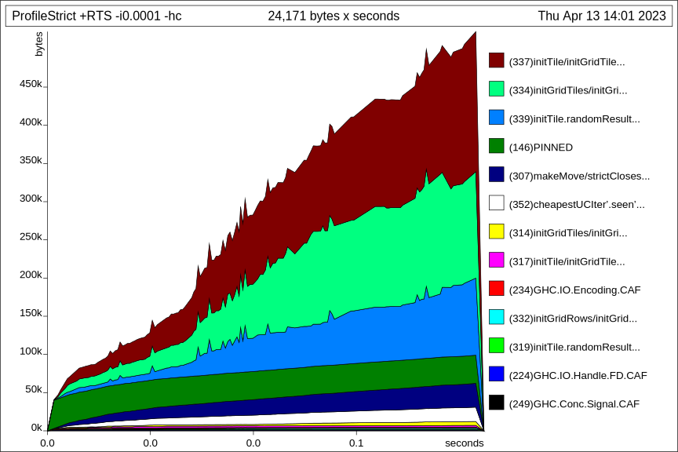
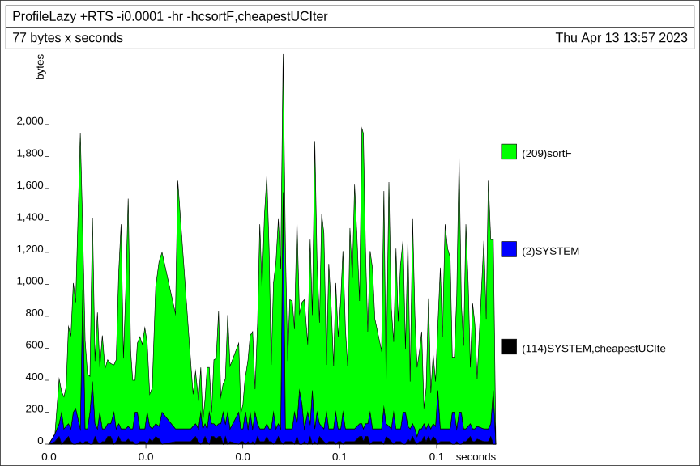
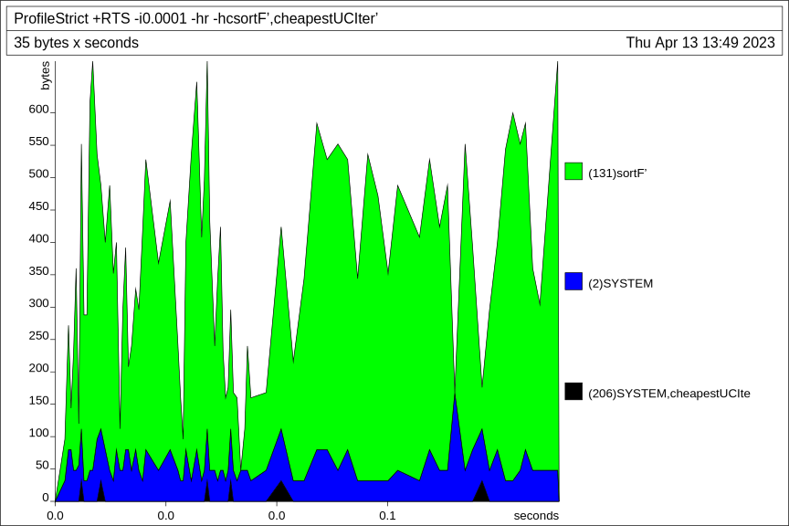

# Functional Programming -- Desert Explorer part 1

**QUESTIONS**
- space leaks in grid, e.g. updating seen
- report in .md format?
- performance to which extent important? Search + grid (see first point)

**TODO**
- UCS is BFS (cost = 1 per change)
- Grid performance

Author: Luca Iacovella  
Email: [luca.iacovella@vub.be](mailto:luca.iacovella@vub.be)

## Source code
In this section, I outline my implementation of the project and motivate my decisions where appropriate. Please consult the source code for a more detailed description for each function.

### Utils.List
The `Utils.List` module contains functions on lists that are not found in `Data.List`. Indexing is implemented to be generic so that the functions accept `Integer` as index. The reason for this is that the game `Grid` is can be infinite, but `Int` is bounded and thus cannot be used to access the entire grid on its own. It has a lazy and strict implementation of quicksort (i.e. `sortF`).

### Models.TerminalGame
`Models.TerminalGame` contains the provided code (by the assistant) for the declaration of `TerminalGame` and `GameState` type classes and running it.

### Models.Grid
To keep track of the game's world, I use a nested list of `GridTiles`, called a `Grid`. The `Grid` is indexed using `Coordinates`, which are tuples of `Integers`. `GridTiles` consists of a `TileType` (`Desert` with or without treasure, `Water`, `Lava` or `Portal`) and whether it has been in sight radius before. The data type `PlayerMove` is used to translate a move to another `Coordinate`. The module `Models.Grid` contains type declarations and functions to use on a `Grid`.

Initially, I implemented the `Grid` as a flat list. The list encoded the 2D semi-infinite matrix by following the (quarter) rings around (0, 0). It saves some space by not needing a nested list. On the other hand, many functions required a conversion step of 2D `Coordinate` index to the index in the flat list. Also, access to `Coordinate` (m, n) is in `O(m * n)`, as opposed to `O(m + n)` in the 2D case. The real reason that I switched implementation is that updating the seen `GridTiles` is not straightforward.

### Utils.UniformCostSearch
To calculate the distances to the closest water, desert and portal tile, I use the `Utils.UniformCostSearch` module. It contains a general implementation of uniform cost search (UCS) which is used for pathfinding. It takes arguments for a starting state and expands the next best state from a sorted list until a goal state is found, while keeping track of visited states. There is also both a lazy and strict implementation. The next best state is found by sorting the list of states, but could be improved by implementing it as a heap based priority queue. 

The pathfinding in practice represents states as coordinates and expands a state by making a move in all possible directions and only keeping those going through allowed `TileTypes`.

Originally, I intended to implement and use A* search. An admissible heuristic can be implemented by taking the Manhattan distance to the closest goal tile. However, finding the closest goal tile is problematic: for each state it requires scanning around it because there is no other way to know the closest one. If one opts for another approach and ends up with a goal tile that is further away, the heuristic overestimates, which in turn leads to a suboptimal solution. Thus, I used UCS to keep things simple.

### Models.AdventureGame
The `Models.AdventureGame` module declares the data types for the game's config `AdventureGameConfig` and game's state `AdventureGameState`. Next, `AdventureGameEvent` is used to keep track of the current important event (if the player died, won or found treasure) and display it as a message. There is data class instantiations to be able to use the `read`, `runGame`, `show` functions for the types when needed. 

Displaying `AdventureGameState` involves showing the tile distances, water and treasure and the `Grid`. The `Grid` is displayed by taking the player position as center and taking the string representation of each tile around it (taking into account if a tile was seen) in the configured dimensions.

`initGrid` initializes a `Grid` based on a `AdventureGameConfig`. It generates an infinite list of infinite lists by the convenience of Haskell's lazy evaluation. A `StdGen` object initialized with the configured seed is passed over the outer list. It generates `Ints` to serve as seeds for the `StdGens` of the inner lists. Each element in the inner lists is initialized using the configured tile percentages and the random number generator.

## Heap profiling
The implementations used for the distance measure are lazy for `sortF` and `cheapestUC` and without memory leak for `sortF'` and `cheapestUC'`. To demonstrate this we initialize a grid with much lava and a far away portal and profile the heap when calculating the distance to the closest portal. The source code is in `Profiling/ProfileLazy.hs` and `Profiling/ProfileStrict.hs` respectively. The overall memory consumption in terms of [cost-centres](https://downloads.haskell.org/ghc/latest/docs/users_guide/profiling.html#cost-centres-and-cost-centre-stacks) for the lazy implementation is as follows:

and for the strict implementation:

There seems barely any difference. However, if we look at the [retainers](https://downloads.haskell.org/ghc/latest/docs/users_guide/profiling.html#retainer-profiling) of interest, first for the lazy implementation:

and then for the strict implementation:

The peaks in memory usage in the lazy implementation are more than double of the peaks in the strict implementation. The strict implementation wastes significantly less memory. 

Note for profiling reproduction: on my OS, I only had access to version 1.1 of the `random` package (`System.Random` module) for profiling. The latest version (1.2) completely changed the RNG implementation, which means that the same seed yields different results. To get a good seed for profiling, run the function defined in `Profiling/ProfileSeed.hs`.